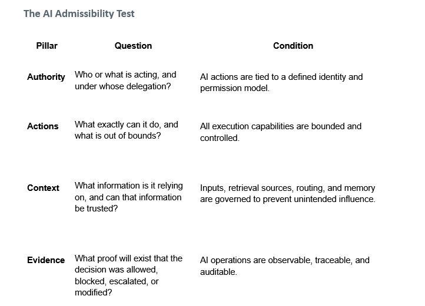

# Admissibility Test Artifact

This release adds a concise, practitioner-facing version of the Admissibility Test.

## Included

- The Admissibility Test table
- Four evaluation pillars: Authority, Actions, Context, and Evidence
- Practical questions and conditions for evaluating whether an AI-enabled system should proceed toward action

## Purpose

The artifact is intended to help practitioners to quickly employ system-governance questions:

> Should this system be allowed to act, under these conditions, with this authority, context, and evidence?

