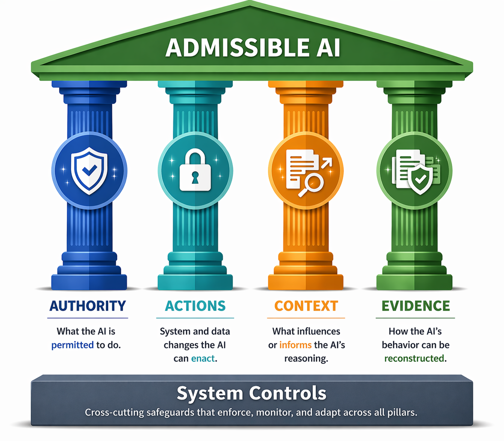

## The Four Pillars

| Pillar | Governance Question |
|---|---|
| Authority | Who or what is allowed to act? |
| Actions | What can the system do? |
| Context | What information influences behavior? |
| Evidence | What must be provable? |